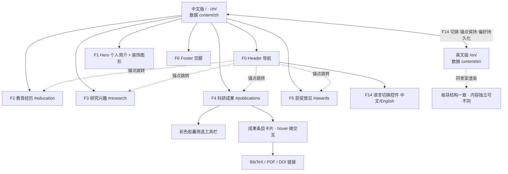

# 学术型个人主页 — 结构化需求文档

| 项目     | 内容                                         |
| -------- | -------------------------------------------- |
| 文档版本 | v1.2                                         |
| 日期     | 2026-09-08                                   |
| 项目名称 | 学术型个人主页（Academic Personal Homepage） |
| 文档状态 | 需求基线，待评审                             |

> **版本变更说明**
>
> - **v1.2**：① 明确**中英文版本内容相互独立、互不翻译、可存在差异**，系统按语言完整读取各自数据集，不做跨语言回退（F14.5/F14.8、§2.3、§4.4）；② 新增**视觉风格需求 F15 与 §7《视觉设计规范》**：简约基调上融入适度活泼元素——彩色配色系统、装饰图形、微交互与轻量动效。
> - **v1.1**：新增**中英文双语切换（i18n）**需求（F14：导航栏语言切换控件、偏好持久化、双语预渲染、hreflang SEO、多语言可扩展架构）。

---

## 1. 项目概述

### 1.1 项目目标

建设一个面向学者/研究生的**学术型个人主页**，用于集中展示教育背景、研究方向、科研成果与获奖情况，作为个人学术身份的线上名片（可用于邮件签名、论文署名、基金申请、求职访学等场景）。

### 1.2 核心设计原则

1. **内容与代码彻底分离**：所有展示内容存放于独立数据文件中，页面组件只负责"按结构渲染"。新增、修改、删除任意内容（包括新增整个板块）**不需要改动组件代码、不需要重构**。
2. **简约而活泼的学术风**：以简约设计为骨架——清晰的排版层级、充足留白、克制的装饰；**不局限于黑白灰**，在简约基调上通过主题色 + 强调色、柔和图形元素与轻量微交互增添活力，视觉层次清晰、体验流畅，符合现代网页设计美学（详见 §7）。
3. **轻量化**：纯静态站点，无后端、无数据库、无登录系统；优先零/极少客户端 JS。
4. **高清与自适应**：适配 PC、平板、手机；适配 Retina/高分屏。
5. **双语原生支持**：中文为默认语言，英文为第二语言；语言能力在架构层原生设计（非事后补丁）。**中英文内容各自独立维护、互不翻译、可存在差异**，未来新增语言无需重构。

---

## 2. 功能清单

### 2.1 功能模块总表

| 编号 | 模块                   | 功能点                                                                                                                                                                        | 优先级 |
| ---- | ---------------------- | ----------------------------------------------------------------------------------------------------------------------------------------------------------------------------- | ------ |
| F0   | 顶部导航               | 姓名/Logo、四大板块锚点导航、平滑滚动、当前板块高亮、移动端折叠菜单（汉堡按钮）、**导航栏右侧语言切换控件（F14）**                                                            | P0     |
| F1   | 个人简介区（Hero）     | 头像、姓名、学术头衔、所属单位、一句话研究方向、个人简介（2–3 段）、邮箱、学术链接（Google Scholar / ORCID / GitHub / ResearchGate 等可选）、CV 下载、**背景装饰图形（F15）** | P0     |
| F2   | **教育经历**           | 时间线展示：时间段、学校、学位、专业/院系、导师（可选）、研究方向简述（可选）、校徽（可选）；按时间倒序                                                                       | P0     |
| F3   | **研究兴趣**           | 按方向分组展示：方向名称、关键词标签（彩色）、简短描述、方向图标；关键词以标签（tag）形式呈现                                                                                 | P0     |
| F4   | **科研成果**           | 成果列表：论文/专利/科研项目/预印本等类型；每条含标题、作者列表（本人高亮）、发表出处（期刊/会议）、年份、卷期页码（可选）、DOI/原文链接、PDF、代码仓库、摘要（可选）         | P0     |
| F4.1 | 成果筛选与排序         | 按**类型**（期刊/会议/专利/项目）和**年份**筛选；默认年份倒序；筛选器为彩色胶囊按钮样式（F15）；可切换"仅看一作/通讯"（可选）                                                 | P1     |
| F4.2 | BibTeX 引用            | 每条成果提供"引用"按钮，点击弹出/复制 BibTeX 条目                                                                                                                             | P1     |
| F5   | **获奖情况**           | 奖项列表/时间线：奖项名称、颁奖机构、获奖时间、奖项级别（国家级/省部级/校级等，可选）、排名/说明（可选）；按时间倒序                                                          | P0     |
| F6   | 页脚                   | 联系方式、最后更新时间、学术链接重复入口、备案号（如需部署在国内服务器）                                                                                                      | P0     |
| F7   | 响应式适配             | 断点自适应布局；移动端导航折叠、时间线纵向化、字号流式缩放、装饰图形自适应简化                                                                                                | P0     |
| F8   | 高清适配               | 图标全部使用 SVG；头像/照片提供 2x/3x 资源或 `srcset`；截图类图片使用 WebP                                                                                                    | P0     |
| F9   | SEO 与社交分享         | 语义化 HTML、`meta description`、Open Graph/Twitter Card 标签、JSON-LD（Person 结构化数据）、sitemap、`hreflang` 双语互指                                                     | P1     |
| F10  | 可访问性               | 语义标签、图片 alt、键盘可导航、颜色对比度达标、跳转链接、`prefers-reduced-motion` 动效降级                                                                                   | P1     |
| F11  | 内容数据校验           | 内容数据文件带类型模式（Schema），构建时按语言分别自动校验：必填字段缺失、字段类型错误、id 重复时构建失败并报错                                                               | P0     |
| F12  | 打印样式               | 打印/CV 导出时隐藏导航、语言控件与装饰元素，排版适配 A4                                                                                                                       | P2     |
| F13  | 访问统计（可选）       | 接入不依赖 Cookie 的轻量统计（如 Umami / 51.la），可配置开关                                                                                                                  | P2     |
| F14  | **中英文切换（i18n）** | 详见下方 F14 功能点                                                                                                                                                           | P0     |
| F15  | **视觉风格与动效**     | 详见下方 F15 功能点（规范见 §7）                                                                                                                                              | P0     |

**F14 中英文切换（i18n）功能点明细**

| 编号   | 功能点             | 需求描述                                                                                                                                                                                         |
| ------ | ------------------ | ------------------------------------------------------------------------------------------------------------------------------------------------------------------------------------------------ |
| F14.1  | 切换控件位置与形态 | 置于**导航栏右侧**（页面右上角区域），常驻可见；桌面端为"中文 / English"文字分段控件（可配地球图标 Globe SVG）；移动端在导航栏保留紧凑切换按钮，汉堡菜单展开后亦含完整切换入口                   |
| F14.2  | 激活态视觉反馈     | 当前语言以主题色高亮/加粗/底色区分，非激活语言为弱化灰色；控件具备 hover/focus 状态，键盘可操作（`aria-label` 标明"切换语言 / Switch language"）                                                 |
| F14.3  | 全站内容切换       | 点击后**所有界面文本**切换语言：四大板块内容、个人简介、导航标签、按钮文案（下载 CV/引用/筛选标签）、页脚、页面 `<title>` 与 SEO 标签                                                            |
| F14.4  | 平滑切换体验       | 切换无白屏闪烁：目标语言页面在悬停/触摸控件时预取；切换后保持当前浏览位置（自动跳转到对应语言页面的同一板块锚点，如 `/en/#publications`）；可配轻微淡入过渡                                      |
| F14.5  | 中英文内容独立加载 | 中文、英文内容分别以**独立数据文件**交付（`src/content/zh/`、`src/content/en/`）；**两套内容互不翻译、可存在差异**（条目数量、措辞、详略均可不同）；文件放入对应目录即被构建自动读取，无需改代码 |
| F14.6  | 语言偏好全站保持   | 用户手动切换后，偏好持久化保存（localStorage）；此后访问任意页面/刷新/从外部链接进入，均保持所选语言；站点内所有内部链接自动携带当前语言前缀，保证全站一致性                                     |
| F14.7  | 首次访问语言检测   | 未设置偏好时，按浏览器语言（`navigator.language`）自动判断：英文环境引导至英文版，其余默认中文版；自动判断仅发生一次，用户手动选择后以用户选择为准                                               |
| F14.8  | 内容独立性与完整性 | 系统按语言**完整读取并只渲染该语言数据集**，不做跨语言内容回退或中英混显；`locales.config` 中已启用（`enabled: true`）的语言，其内容文件缺失或 Schema 校验失败时**构建失败**并明确报错           |
| F14.9  | 多语言架构可扩展   | 语言由注册表统一配置（语言代码采用 BCP 47，如 `zh-CN`/`en`）；未来新增语种 = 新增一个语言内容目录 + 一份界面文案字典 + 注册表加一行，**零代码改动**（见 §4.4）                                   |
| F14.10 | 双语 SEO           | 各语言版本独立 URL（`/` 中文版、`/en/` 英文版）；输出 `<html lang>`、`hreflang` 互指标签（含 `x-default`）、各语言独立的 title/description/Open Graph/JSON-LD                                    |

**F15 视觉风格与动效功能点明细**（完整规范见 §7）

| 编号  | 功能点       | 需求描述                                                                                                                             | 优先级 |
| ----- | ------------ | ------------------------------------------------------------------------------------------------------------------------------------ | ------ |
| F15.1 | 彩色设计系统 | 中性色为底 + 1 个学术主色 + 1–2 个强调色（链接、标签、按钮、图标、时间线等着色）；设计 token 以 CSS 变量集中管理；对比度满足 WCAG AA | P0     |
| F15.2 | 装饰图形元素 | Hero 区低饱和抽象装饰（渐变光斑/几何线条/点阵，CSS/SVG 实现）；统一线性图标风格；圆角卡片 + 柔和阴影；移动端装饰自动简化             | P1     |
| F15.3 | 微交互       | 卡片 hover 轻微上浮 + 阴影加深、按钮/链接颜色过渡与下划线滑入、标签 hover 反馈、语言切换过渡；反馈即时（150–300ms）                  | P1     |
| F15.4 | 滚动入场动效 | 板块/卡片进入视口时淡入 + 轻微上移（每元素仅播放一次）；仅用 transform/opacity 实现；遵循 `prefers-reduced-motion` 自动禁用          | P2     |
| F15.5 | 视觉层级     | 明确的字号/字重/行高阶梯、统一的板块间距与卡片内边距、充足留白；单屏强调色克制不喧宾夺主                                             | P0     |

### 2.2 内容条目字段定义（数据 Schema 摘要）

**教育经历（education）**
`id`、`startDate`、`endDate`（至今用 `present`）、`institution`、`degree`、`major`、`department?`、`advisor?`、`description?`、`logo?`

**研究兴趣（researchInterests）**
`id`、`title`（方向名）、`keywords[]`（关键词标签）、`description?`、`icon?`

**科研成果（publications）**
`id`、`type`（journal/conference/patent/project/preprint）、`title`、`authors[]`（`name` + `isSelf?` 标记本人）、`venue`、`year`、`volume?`、`pages?`、`publisher?`、`doi?`、`url?`、`pdf?`、`code?`、`abstract?`、`bibtex?`、`highlight?`（代表作标记）、`status?`（在审/已接收）

**获奖情况（awards）**
`id`、`title`、`issuer`（颁奖机构）、`date`、`level?`、`rank?`（个人排名）、`description?`

**个人信息（profile，站点级单条）**
`name`、`title`、`affiliation`、`avatar`、`email`、`bio[]`、`address?`、`links[]`（`label`/`url`/`icon`）、`cvFile?`

> 字段约定：除标注 `?` 为可选外均为必填；`id` 在**各自语言数据文件内部**唯一即可；日期统一 `YYYY-MM` 或 `YYYY` 格式（展示时按语言本地化格式化，如 `2026年9月` / `Sep 2026`）。
>
> **双语内容约定（重要）**：中文与英文数据文件是**两套相互独立的数据集，互不翻译、内容允许存在差异**——条目的数量、选取范围、文字详略均可不同（例如：中文版可侧重中文论文与国内奖项，英文版可侧重英文论文与国际经历；个人简介可分别独立撰写）。系统按语言读取各自文件并完整渲染，不做跨语言对齐、回退或混显。DOI、URL、邮箱等客观字段按各自版本实际情况填写。

### 2.3 国际化数据结构（中英文双版本，内容相互独立）

内容与界面文案均**按语言分目录**组织。每种语言的数据文件独立交付、独立维护，放入约定目录即被自动加载：

```
src/
├── content/
│   ├── sections.config        板块注册表（板块结构/锚点/顺序，各语言共用骨架）
│   ├── zh/                    中文数据集（默认语言）
│   │   ├── profile.json       个人信息
│   │   ├── education.json     教育经历
│   │   ├── research.json      研究兴趣
│   │   ├── publications.json  科研成果
│   │   └── awards.json        获奖情况
│   └── en/                    英文数据集（独立文件交付，内容可与中文不同）
│       ├── profile.json
│       ├── education.json
│       ├── research.json
│       ├── publications.json
│       └── awards.json
└── i18n/
    ├── locales.config         语言注册表：语言代码 / 显示名 / 是否默认 / 是否启用
    ├── ui.zh.json             中文界面文案字典
    └── ui.en.json             英文界面文案字典
```

**规则**：

1. **文件契约（预留数据接口）**：每种语言一个同名目录，目录内文件名与 §2.2 数据项一一对应；构建时数据加载模块（统一文件读取接口）按当前语言读取对应目录文件。新增/更新某语言内容只需操作该语言目录，无需改代码。
2. **数据集完全独立**：`zh/` 与 `en/` 是两套自包含数据，条目数量与内容均可不同；`id` 仅在本语言文件内唯一，**不做跨语言 id 对齐校验**；渲染时只呈现本语言数据，**不跨语言回退、不混显**。
3. **板块骨架共用**：四大板块的结构、锚点 id（`#education`/`#research`/`#publications`/`#awards`）、排列顺序由 `sections.config` 统一控制，保证语言切换时锚点跳转有效；各板块内部的条目内容由各语言数据自行决定。
4. **界面文案字典**：非内容类固定文案（导航名、板块标题、"下载 CV""引用""全部类型"等按钮与筛选项、`aria-label`、页脚提示语）由 `ui.<lang>.json` 分别维护，组件中禁止硬编码任何文案。
5. **语言注册表（locales.config）**：登记支持的语言，示例：

   ```json
   [
     {
       "code": "zh-CN",
       "name": "中文",
       "dir": "ltr",
       "isDefault": true,
       "enabled": true
     },
     {
       "code": "en",
       "name": "English",
       "dir": "ltr",
       "isDefault": false,
       "enabled": true
     }
   ]
   ```

   - `enabled: true` 的语言，其 5 个内容文件与 `ui.<lang>.json` 必须齐备且通过 Schema 校验，否则**构建失败**并指明缺失/错误的文件；某语言文件尚未就绪时可先置 `enabled: false`，不影响其他语言构建。

6. **语言代码**：采用 BCP 47 标准；URL 与目录名使用短码（`zh`/`en`），HTML 属性使用标准码（`zh-CN`/`en`）。
7. **资源文件**：图片放 `public/images/` 由两个语言版本共用；语言专属资源（如中文版/英文版 CV）以语言后缀区分（`cv-zh.pdf` / `cv-en.pdf`），在各语言 `profile.json` 中分别引用。

---

## 3. 页面结构拓扑图

站点为**单页应用式静态页**（One-Page），顶部导航通过锚点跳转各板块；板块顺序与导航项由"板块注册表"配置自动生成。站点按语言预渲染为两套静态页面：中文版 `/`（`/zh/`）、英文版 `/en/`，二者板块骨架一致、**内容数据相互独立**。

```
中文版 /（/zh/）  ←→  英文版 /en/        （F14 语言切换：互链 + 锚点保持 + 偏好持久化）
   数据：content/zh/      数据：content/en/   （两套独立数据，内容可不同）
│
├── F0  Header 顶部导航
│   ├── 姓名 / Logo（点击回顶部）
│   ├── 导航锚点：教育经历 · 研究兴趣 · 科研成果 · 获奖情况
│   ├── 语言切换控件：[ 中文 | English ]（当前语言主题色高亮，F14/F15）
│   └── [移动端] 汉堡菜单 → 折叠面板（菜单内含语言切换入口）
│
├── F1  Hero 个人简介
│   ├── 背景装饰图形（渐变光斑/点阵/几何线条，F15.2，低存在感）
│   ├── 头像（高清，圆形/方形可配）
│   ├── 姓名 + 学术头衔（主色点缀）+ 所属单位
│   ├── 个人简介正文
│   ├── 联系方式：邮箱（mailto）
│   └── 学术链接图标组（Scholar / ORCID / GitHub …，hover 微交互）+ CV 下载按钮
│
├── F2  Section#education 教育经历
│   └── 时间线卡片 ×N（倒序）：主色时间线节点 · 校徽 · 学校 · 学位 · 专业 · 导师 · 简述
│
├── F3  Section#research 研究兴趣
│   └── 方向卡片 ×N：方向图标 · 方向名 · 彩色关键词标签组（F15.1）· 描述
│
├── F4  Section#publications 科研成果
│   ├── 筛选工具栏：彩色胶囊筛选按钮（类型 · 年份 · 排序，F15.1）
│   └── 成果条目 ×N（倒序，卡片 hover 上浮 F15.3）
│       ├── 标题（链接原文/DOI）· 类型彩色标签 · 代表作标记
│       ├── 作者（本人加粗/主题色高亮）· 出处 · 年份
│       ├── 摘要（可展开）
│       └── 操作链接：PDF · 代码 · DOI · BibTeX 引用
│
├── F5  Section#awards 获奖情况
│   └── 奖项条目 ×N（倒序）：时间 · 奖项名 · 颁奖机构 · 级别/排名 · 说明
│
└── F6  Footer 页脚
    ├── 联系方式 / 学术链接
    ├── 最后更新时间（构建时自动生成）
    └── 备案号 / 版权信息（可选）
```

Mermaid 结构图：



---

## 4. 系统架构与内容迭代更新规则

### 4.1 架构总览（支撑"无需重构即可增删改"）

采用 **静态站点 + 数据驱动渲染** 架构：

```
┌──────────────────────────────────────────────────────┐
│  内容层（用户日常只动这里）                             │
│  src/content/                                        │
│   ├── sections.config      板块注册表（骨架/锚点/顺序） │
│   ├── zh/                  中文数据集（独立维护）       │
│   │   └── profile / education / research /           │
│   │       publications / awards .json                │
│   └── en/                  英文数据集（独立维护，       │
│       └── profile / education / research /           │   内容可与中文不同）
│           publications / awards .json                │
│  src/i18n/                                           │
│   ├── locales.config       语言注册表                 │
│   └── ui.zh.json / ui.en.json  界面文案字典           │
├──────────────────────────────────────────────────────┤
│  校验层                                               │
│   内容 Schema 校验（按语言分别执行）+ 文案 key 校验     │
│   → 启用语言文件缺失/字段错误即构建失败并指明文件       │
├──────────────────────────────────────────────────────┤
│  渲染层（通用组件，建好后不再改动）                      │
│   <SectionShell> 通用板块容器（标题/锚点/布局）         │
│   <Timeline>     通用时间线（教育/获奖共用）            │
│   <TagGroup>     彩色标签组（研究兴趣用）              │
│   <PubList>      成果列表 + 胶囊筛选器                 │
│   <LangSwitch>   语言切换控件（F14）                   │
│   <HeroDecor>    装饰图形层（F15）                     │
│   <Hero> / <Header> / <Footer>                        │
│   ※ 文案经 i18n 字典/内容数据读取，组件无硬编码文字     │
│   ※ 颜色/圆角/阴影/间距/动效时长全部由 CSS 变量 token 管理 │
├──────────────────────────────────────────────────────┤
│  构建产物（按语言预渲染的纯静态页面）                    │
│   /（中文版） · /en/（英文版）                         │
│   + hreflang 互指标签 → 部署至任意静态托管             │
└──────────────────────────────────────────────────────┘
```

**关键机制**：

- 板块由 `sections.config` 注册表驱动：锚点 id、排列顺序、使用哪个通用渲染器全部由配置生成。
- 语言由 `locales.config` 注册表驱动：构建时按启用语言逐套预渲染，渲染层**只从该语言目录读取内容**、从 `ui.<lang>.json` 读取界面文案，两套数据互不影响。
- 通用渲染器按 Schema 渲染数据，不内置任何具体内容、不内置任何语言文案。
- 新增**条目** = 往对应语言 JSON 数组里加一个对象；新增**整个板块** = 加数据文件 + 注册表加一行（若结构与现有通用组件不兼容才需扩展组件，此为唯一写代码场景，且不影响既有板块）。
- 新增**语言** = 新增一个语言内容目录 + 一份界面文案字典 + 语言注册表加一行（见 §4.4）。

### 4.2 内容增 / 删 / 改规则

| 操作                                     | 步骤                                                                                                                 | 是否需要改代码               |
| ---------------------------------------- | -------------------------------------------------------------------------------------------------------------------- | ---------------------------- |
| 新增一条内容（如中文版新增一篇中文论文） | 打开 `src/content/zh/*.json` → 追加符合 Schema 的对象（含本文件内唯一 id）                                           | 否                           |
| 修改内容（如更新头衔、论文状态）         | 在**对应语言**数据文件中编辑字段                                                                                     | 否                           |
| 删除内容                                 | 仅从该语言数据文件删除对象即可；另一语言版本不受影响                                                                 | 否                           |
| 调整板块顺序 / 导航名称                  | 编辑 `sections.config` 中的 `order` / `navLabel`                                                                     | 否（仅改配置）               |
| 隐藏某板块                               | 在注册表中将 `visible` 置为 `false`                                                                                  | 否                           |
| 新增一个同构板块（如"学术兼职"，列表型） | 新建数据文件 + 注册表加一行，复用通用列表渲染器                                                                      | 否                           |
| 新增一个异构板块（结构特殊，如"相册"）   | 新增数据文件 + 注册渲染器组件                                                                                        | 是（一次性扩展，不动旧代码） |
| **交付/更新英文内容**                    | 将英文独立数据文件放入 `src/content/en/`（界面文案放入 `src/i18n/ui.en.json`），构建自动加载；英文内容与中文无需一致 | 否                           |
| **英文版暂未就绪**                       | `locales.config` 中将 `en` 置为 `enabled: false`，仅中文版上线；文件齐备后启用并重新构建                             | 否（仅改配置）               |
| **新增一种语言（如日语）**               | 新建 `src/content/<lang>/` 目录（5 个数据文件）+ `ui.<lang>.json` + `locales.config` 加一行                          | 否                           |

### 4.3 内容编辑规范

1. **唯一事实来源**：页面上所有文字信息只能来自 `src/content/` 与 `src/i18n/`，禁止在组件内硬编码内容与文案。
2. **id 规范**：条目 id 在**各自语言文件内**唯一、语义化（如 `pub-2026-nature-xxx`）；中英文互不要求对齐。
3. **日期规范**：统一 `YYYY` 或 `YYYY-MM`；"至今"用 `"present"`；展示时按语言本地化。
4. **排序**：列表类内容默认按日期倒序；需要手动置顶时使用 `highlight: true` 或 `order` 字段。
5. **双语内容独立维护**：中文编辑只动 `zh/`，英文编辑只动 `en/`；两套数据的条目数量、内容、措辞允许不同，互不影响、无翻译义务。
6. **资源文件**：
   - 图片放 `public/images/`，PDF/CV 放 `public/files/`；
   - 命名：小写英文 + 连字符（`avatar.jpg`、`cv-en.pdf`）；
   - 照片优先 WebP，单张图片 ≤ 300KB，头像提供 2x 尺寸；
   - 数据中只引用路径，不内嵌 base64。
7. **校验与预览**：本地 `npm run dev` 实时预览（可切换语言查看）；`npm run build` 对每个启用语言执行 Schema 校验，**校验不通过不得发布**。
8. **版本管理**：内容变更走 Git 提交，提交信息区分 `content(zh):` / `content(en):` / `code:` 前缀；历史内容可追溯、可回滚。
9. **更新流程**：编辑数据文件 → 本地预览自查 → 构建校验通过 → 提交 → 自动部署（CI/CD）→ 线上核验。
10. **维护提示**：仓库内置一份《内容编辑指南》（一页纸），说明目录结构、每个字段含义与示例，非开发人员亦可照做。

### 4.4 国际化（i18n）运行规则

**（1）路由与版本形态**

- 采用**构建期预渲染**：每种启用语言输出为独立的纯静态页面，中文版 `/`（同时兼容 `/zh/`），英文版 `/en/`。预渲染保证禁用 JS 时各语言内容完整可读、对 SEO 友好、切换为静态页跳转无翻译计算开销。
- 页面内板块锚点在各语言下保持一致（`#education`、`#research`、`#publications`、`#awards`），语言切换链接携带当前锚点。

**（2）语言检测与偏好持久化**（全站一致性）

```
首次访问
  ├─ localStorage 已有语言偏好？ ── 是 ──→ 直接进入偏好语言版本
  └─ 否 ──→ 读取浏览器语言 navigator.language
               ├─ en* ──→ 引导至 /en/（英文版，若已启用）
               └─ 其他 ──→ 默认中文版 /
用户点击切换控件
  └─ 跳转目标语言页面（保持当前锚点）+ 写入 localStorage（键：lang）
       └─ 此后访问任意页面/刷新/外链进入 ──→ 均读取偏好，全站保持一致
```

- 站点内所有内部链接由路由函数自动生成语言前缀，不会出现"英文版里点导航跳回中文版"的串语言问题。
- 显式 URL 优先级高于 localStorage（用户直接访问 `/en/` 时展示英文，并同步更新偏好）。
- 浏览器语言指向的语言未启用时，回退到默认中文版。

**（3）语言数据加载机制（独立文件、内容可不同）**

- 中文、英文内容均以**独立数据文件**交付：中文放入 `src/content/zh/`、英文放入 `src/content/en/`，界面文案放入对应 `ui.<lang>.json`。
- 构建时数据加载模块（统一文件读取接口，即预留的数据接口）按语言读取对应目录：**该语言页面只呈现本语言数据集**，不跨语言读取、不回退、不混显。
- 两套数据互不翻译：条目数量、内容、措辞允许存在差异（如中英文论文/奖项列表不同），系统对此不作任何一致性假设。
- 完整性门禁：`enabled: true` 的语言若缺少必需文件或 Schema 校验失败，**构建失败**并指明文件路径与错误字段；语言未就绪时置 `enabled: false` 即可不构建该语言。
- 英文版可分期交付：先上线中文版，英文文件就绪后放入目录、启用并重新构建即上线，**无需二次开发**。

**（4）切换交互**

- 控件固定在导航栏右侧，形态为分段开关：`[ 中文 | English ]`，可搭配 Globe 图标；当前激活语言以**主题色 + 加粗/底色**高亮，未激活语言弱化灰色。
- 移动端：导航栏右侧保留紧凑图标/短文字按钮（常驻可见），汉堡菜单展开后顶部同样提供完整切换项。
- 平滑性：悬停/触摸控件时预取（prefetch）目标语言页面；切换后定位到同一板块锚点；页面切换使用轻微淡入过渡，避免白屏感。
- 可访问性：控件为原生链接/按钮，可键盘 Tab 聚焦与回车触发，带 `aria-label` 与 `aria-current` 状态。

**（5）多语言可扩展性**

- 语言注册表 `locales.config` 为唯一语言清单；语言代码遵循 BCP 47；预留 `dir` 字段以兼容未来 RTL 语言（如阿拉伯语）。
- 新增语言标准动作：① 新建 `src/content/<lang>/` 目录及 5 个数据文件；② 新建 `src/i18n/ui.<lang>.json`；③ 在 `locales.config` 注册一行。组件与构建逻辑零改动。

**（6）双语 SEO 与本地化细节**

- 每个语言页面输出 `<html lang="zh-CN|en">`、独立的 `<title>`/`meta description`/Open Graph；页面 `<head>` 内输出 `hreflang` 互指：`zh-CN`、`en`、`x-default`（指向默认中文版）。
- 日期按语言本地化格式化；中英文字体栈分别设置；英文文本长度平均比中文长约 30%，导航、按钮、标签布局需容纳膨胀不溢出、不换行错乱。

---

## 5. 兼容性需求

### 5.1 浏览器兼容

| 平台   | 支持范围                                                                            |
| ------ | ----------------------------------------------------------------------------------- |
| 桌面端 | Chrome、Edge、Firefox、Safari **最近 2 个大版本**（Chromium / WebKit / Gecko 内核） |
| 移动端 | iOS Safari 15+；Android Chrome 最近 2 个大版本；微信内置浏览器                      |
| 不支持 | Internet Explorer 全系列（不做适配）                                                |

### 5.2 设备与分辨率

| 类别   | 断点        | 布局要求                                                         |
| ------ | ----------- | ---------------------------------------------------------------- |
| 手机   | 320–767px   | 单栏；导航折叠为汉堡菜单；时间线纵向；字号流式缩放；装饰图形简化 |
| 平板   | 768–1279px  | 单栏/双栏自适应；导航完整展示                                    |
| 桌面   | 1280px 以上 | 内容区最大宽度约 1080–1200px 居中，两侧留白                      |
| 超宽屏 | ≥1920px     | 内容限宽居中，不拉满整屏                                         |

### 5.3 高分屏与其他

- **高清适配**：DPR 2x/3x 屏幕下图标与图片清晰；图标一律 SVG；位图提供 `srcset` 多尺寸或 2x 资源。
- **渐进增强**：核心内容（四大板块文字信息）由静态 HTML 输出，**禁用 JavaScript 时内容仍完整可读**（中英双版均为预渲染静态页）；语言切换基础形态为静态链接跳转，无 JS 时亦可切换；筛选、动效等为增强能力。
- **系统兼容**：Windows / macOS / iOS / Android 主流版本。
- **网络环境**：弱网（3G/高延迟）下首屏文字内容优先呈现，图片懒加载。

### 5.4 双语版本适配

- **布局容差**：英文文案长度平均比中文长约 30%，导航项、板块标题、按钮、标签、时间线卡片在英文下不得溢出、错位或异常换行；中英文分别走查全部断点。
- **字体**：中英文使用各自字体栈（中文：系统黑体栈；英文：系统无衬线/学术衬线栈），字号、行高分别调校，英文版正文可读性不低于中文版。
- **语言控件**：在 320px 最小宽度下切换控件仍清晰可点（触控目标 ≥ 44×44px），不与汉堡菜单重叠。
- **偏好一致性**：刷新页面、浏览器前进/后退、从页内锚点分享链接打开，语言状态均符合 §4.4（2）的规则。
- **存储兼容**：localStorage 被禁用（隐私模式）时不报错，退化为按 URL 语言前缀 + 浏览器语言判断。

### 5.5 动效与装饰适配

- 动效仅使用 `transform`/`opacity`（合成层属性），不触发布局重排；滚动入场动效在低端设备上不卡顿。
- 系统开启"减少动态效果"（`prefers-reduced-motion: reduce`）时，入场/过渡动效自动禁用，内容直接完整呈现。
- Hero 装饰图形在移动端/小屏自动简化或收敛，不遮挡文字、不产生横向滚动。

---

## 6. 非功能需求

### 6.1 性能与加载速度

| 指标                | 要求                                                                                          |
| ------------------- | --------------------------------------------------------------------------------------------- |
| 站点形态            | 纯静态（预渲染 HTML），无后端请求、无数据库查询                                               |
| LCP（最大内容绘制） | 4G 网络下 **< 2.5s**                                                                          |
| 首屏资源体积        | HTML+CSS+JS 合计 gzip 后 **< 300KB**（框架优先零 JS 输出，交互 JS 按需）                      |
| 图片                | 全部懒加载（首屏头像除外）；WebP/AVIF 格式；提供响应式尺寸                                    |
| 字体                | 使用系统字体栈或子集化字体，字体文件 ≤ 100KB，`font-display: swap`                            |
| 第三方资源          | 无重型第三方库（不引入动画库/UI 框架库）；统计脚本异步加载、可关闭                            |
| 动效性能            | 仅 transform/opacity 合成层动画；CLS（布局偏移）**< 0.1**；reduced-motion 全降级              |
| 缓存与分发          | 静态资源长缓存（hash 文件名）；推荐 CDN 托管                                                  |
| 双语开销            | 双语言预渲染，无运行时翻译库；切换为静态页跳转 + 预取，单语言页面体积预算不变（gzip < 300KB） |
| 质量基线            | Lighthouse Performance / SEO / Accessibility 均 **≥ 90 分**（中英双版分别达标）               |

### 6.2 可扩展性

1. **内容扩展**：增删改条目零代码（见第 4 节）；条目字段可在 Schema 中向后兼容地新增（新字段一律可选）。
2. **板块扩展**：板块注册表机制支持新增板块；通用渲染器覆盖"时间线 / 标签组 / 列表 / 卡片"四类常见结构。
3. **多语言扩展**：中英双语为已实现能力（F14），语言注册表 + 按语言分目录的文件契约支持未来新增语种零代码扩展；各语言数据集完全独立、互不翻译；预留 RTL 语言支持字段。
4. **主题扩展**：颜色、圆角、阴影、间距、动效时长全部收敛为 CSS 变量设计 token，后续调整配色主题只需修改变量，不改组件。
5. **组件复用**：UI 组件与数据 Schema 一一对应、无耦合，新页面/新板块可直接复用。
6. **部署扩展**：构建产物为纯静态文件，可部署于 GitHub Pages、Vercel、Netlify、学校服务器或任意 Nginx，迁移零成本。

### 6.3 其他非功能需求

- **可维护性**：组件化结构、统一命名规范；设计 token 集中管理；内容编辑指南随仓库提供；技术栈选择大众化（推荐静态站点生成器 + JSON/TS 数据文件）。
- **可访问性**：符合 WCAG 2.1 AA；语义化标签（`header/nav/section/footer`、`h1–h3` 层级）；所有图片含 `alt`；完整键盘可操作；正文与彩色元素对比度 ≥ 4.5:1；动效遵循 `prefers-reduced-motion`。
- **SEO**：每个板块语义化标题；`title`/`description`/Open Graph 卡片；JSON-LD `Person` 结构化数据；自动生成 `sitemap.xml`；中英双版输出 `hreflang` 互指标签与独立 `<html lang>`。
- **安全性**：纯静态、无用户输入、无管理后台，攻击面极小；所有外链加 `rel="noopener noreferrer"`；邮箱可用图片/JS 混淆方式防爬（可选）。
- **可靠性**：构建校验（Schema + 类型检查，按语言分别执行）作为发布门禁，错误内容无法上线；部署支持一键回滚。

---

## 7. 视觉设计规范（简约 × 活泼）

### 7.1 设计基调

**简约为骨、活泼为韵**：大面积中性色与留白保证学术站点的克制与可信度；通过主题色/强调色、柔和装饰图形与轻量微交互在细节处增添活力。视觉层次清晰、交互反馈流畅、符合现代网页设计美学。活泼元素服务于信息传达与情绪点缀，不喧宾夺主。

### 7.2 色彩系统

- **中性底色**：暖白/浅灰背景（避免纯白刺眼，如 `#FAFAF7`–`#F5F5F2` 区间），文字深灰近黑（如 `#1F2328` 区间），分隔线/边框使用浅灰。
- **主色（学术主题色）**：1 个沉稳而有活力的颜色（建议靛蓝/青蓝区间，如 `#3B5BDB`/`#2563EB` 类），用于导航激活态、链接、主按钮、时间线节点、本人作者名高亮。
- **强调色**：1–2 个暖色/青色（如琥珀 `#F59E0B`、青绿 `#0D9488`、珊瑚类），仅用于关键词标签、成果类型徽标、少量图标等点睛元素。
- **用色比例**：约 **60% 中性 / 30% 主色 / 10% 强调**；单屏内彩色元素克制，不做大面积高饱和铺底。
- **可访问性**：所有彩色文字/图标与背景对比度 ≥ 4.5:1（WCAG AA）；彩色不作为传达信息的唯一手段（类型标签同时带文字）。
- 最终色值以设计稿为准，但须遵循上述结构与比例。

### 7.3 图形元素

- **Hero 装饰**：低饱和度抽象背景——柔和渐变光斑、细网格/点阵、几何线条（纯 CSS/SVG 实现，零图片请求）；透明度与存在感低，不干扰头像与文字阅读；移动端自动简化或隐藏。
- **图标**：全站统一线性（stroke）SVG 风格，描边粗细一致；学术链接、研究方向、操作按钮图标使用主色/强调色。
- **卡片**：大圆角（12–16px）、细边框（1px 浅灰）或极浅柔和阴影；hover 时轻微上浮（translateY 2–4px）+ 阴影加深。
- **时间线**：主色节点圆点 + 细连线，节点可带小图标。
- **标签/徽标**：关键词标签使用强调色浅底 + 深字（柔和 pill 样式）；成果类型徽标按类型分配区分色但保持同一明度体系。

### 7.4 动效规范

- **类型**：
  - 微交互：按钮/链接颜色过渡、导航链接下划线滑入、卡片 hover 上浮与阴影加深、标签 hover 底色变化、语言切换淡入；
  - 滚动入场：板块标题与卡片进入视口时 fade-in + 上移 8–16px（每元素仅播放一次）。
- **参数**：时长 150–400ms，缓动 `ease-out`；仅使用 `transform`/`opacity`，不触发布局重排。
- **实现**：以 CSS 过渡/动画为主；入场触发可用极轻量 IntersectionObserver（或浏览器原生滚动驱动动画渐进增强），**不引入动画库**。
- **降级**：`prefers-reduced-motion: reduce` 时自动禁用全部非必要动效，内容直接完整呈现；禁用 JS 时动效缺失不影响内容与布局。

### 7.5 排版与间距

- 字号阶梯建议：H1 40–48 / H2 28–32 / H3 20–24 / 正文 16 / 辅助 14（px，桌面端）；字重对比明确（标题 700、正文 400）；正文行高 1.6–1.8。
- 板块间距：桌面端 80–120px，移动端 48–64px；卡片内边距 20–28px；全站间距使用统一刻度（4 的倍数）。
- 标题与正文层级一眼可辨；每个板块有统一的标题样式（可配主色小图标/短色条）。

### 7.6 风格边界（不做什么）

- 不使用大面积高饱和色、荧光色、花哨多色渐变；
- 不使用弹跳、闪烁、视差滚动等浮夸/分散注意力的动效；
- 不使用装饰性手写字体或超过 2 种的正文字体；
- 装饰图形不承载信息、不遮挡内容、不影响阅读节奏。

---

## 8. 验收标准（摘要）

1. 四大板块（教育经历、研究兴趣、科研成果、获奖情况）内容完整、字段符合 Schema。
2. 在数据文件中完成一次"新增 + 修改 + 删除"条目操作，**全程未修改任何组件代码**，页面正确渲染。
3. PC（1920/1440/1280）、平板（768/1024）、手机（375/320）及 2x 高分屏下布局正常、无横向滚动、图片清晰。
4. Chrome/Edge/Firefox/Safari 及微信浏览器最近版本显示正常；禁用 JS 后内容可读。
5. Lighthouse 三项评分 ≥ 90；首屏 LCP < 2.5s（中英双版分别验证）。
6. 构建时故意制造字段错误，构建失败并给出明确报错信息（指明语言与文件）。
7. **语言切换**：导航栏右侧切换控件在 PC/移动端均可见、激活语言有明确主题色高亮；点击后全站文案（内容 + 界面 + 浏览器标签标题）切换为目标语言，无白屏、无漏翻文本。
8. **锚点保持**：在中文版 `/#publications` 处点击 English，落地页为 `/en/#publications` 且定位到对应板块。
9. **偏好持久化**：切换语言后刷新页面、新开标签页、从外链进入，均保持所选语言；英文版内点击导航/链接不会串回中文版；localStorage 被禁用时功能不报错。
10. **内容独立性（核心）**：中英文为两套独立数据——仅在 `en/` 文件中新增/删除条目，英文版相应变化而中文版不受影响，反之亦然；两版条目数量与内容允许不同；页面上不出现中英混显；已启用语言缺少数据文件时构建失败并指明缺失文件。
11. **英文分期上线**：`en` 置为 `enabled: false` 时仅中文版可正常构建上线；放入英文文件并启用后，英文版完整呈现。
12. **可扩展性验证**：在 `locales.config` 注册一个新语言码并放入对应内容目录/文案字典后，构建产出第三套语言页面，过程中未修改任何组件代码。
13. **视觉风格**：页面呈现主色 + 强调色的彩色系统（非黑白灰），关键词标签、链接、按钮、时间线节点等着色协调；Hero 装饰图形、圆角卡片、统一图标风格到位；字号/间距层级清晰；各断点下装饰不遮挡内容。
14. **动效与微交互**：卡片/按钮/链接 hover 反馈与滚动入场动效流畅、无卡顿；CLS < 0.1；开启系统"减少动态效果"后动效全部禁用且内容完整；动效不引入第三方动画库。
